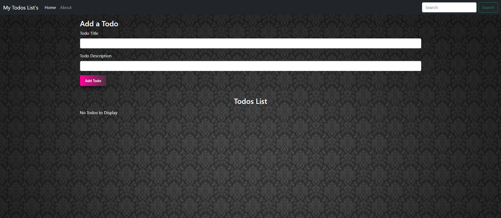

# Todo's List - React

The goal of this project is to create a Todo's List by using **React**



### Main features

* 

* 

*

* 


* 


## Folder directory of the Project
```              
📦Todo_List
 ┣ 📂node_modules 
 ┣ 📂public
 ┃ ┣ 📜favicon.ico
 ┃ ┣ 📜index.html
 ┃ ┣ 📜logo134.jpeg
 ┃ ┣ 📜logo192.png
 ┃ ┣ 📜logo512.png
 ┃ ┣ 📜manifest.json
 ┃ ┗ 📜robots.txt
 ┣ 📂src
 ┃ ┣ 📂MyComponents
 ┃ ┃ ┣ 📜About.js
 ┃ ┃ ┣ 📜AddTodo.jsx
 ┃ ┃ ┣ 📜Footer.js
 ┃ ┃ ┣ 📜Header.js
 ┃ ┃ ┣ 📜TodoItem.jsx
 ┃ ┃ ┗ 📜Todos.jsx
 ┃ ┣ 📜App.css
 ┃ ┣ 📜App.jsx
 ┃ ┣ 📜App.test.js
 ┃ ┣ 📜index.css
 ┃ ┣ 📜index.js
 ┃ ┣ 📜logo.svg
 ┃ ┣ 📜reportWebVitals.js
 ┃ ┗ 📜setupTests.js
 ┣ 📜.gitignore
 ┣ 📜LICENSE
 ┣ 📜package-lock.json
 ┣ 📜package.json
 ┗ 📜README.md
```
Note:- Some of  file are only visible after  applying the migrations
           


## Version(**Used while making project**) 

React :
     
     React  17.0.2
     
     
NPM :
   
     npm 8.1.2
     
   
## Install project dependencies:(**Ignore if you have following dependencies in you computer**)

Node Js:
     
     https://nodejs.org/en/
     
     
NPM :
   
     npm install -g npm
        

# Todo's List's - React

## Getting Started

First clone the repository from Github and switch to the new directory:

     git clone https://github.com/sa24449/Todos_List.git
     

Move to Project directory:

     cd Todos_List
     
    
Download all the direct and transitive dependencies:

     npm install
    

You can now run the development server:

     npm start
     

In Terminal you can find project is running on your local host on successful run  
   
     http://localhost:3000
