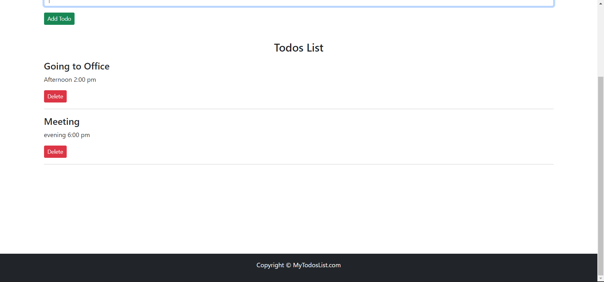
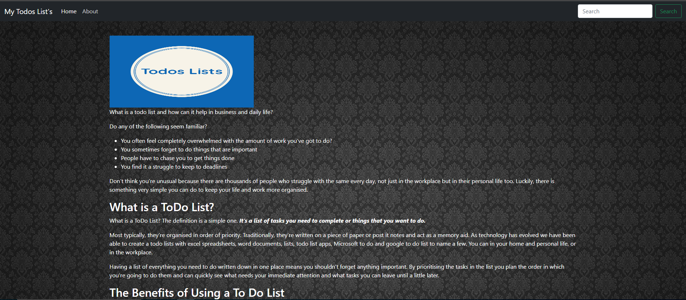

# Todo's List - React [Demo](https://todos-lists-sagaranand.netlify.app/)

The goal of this project is to create a Todo's List by using **React**


### Main features

* You can List  the task's  need to complete or things you want to do.



* More information about Todo's list visit our **About page** 



## Folder directory of the Project
```              
📦Todo_List
 ┣ 📂node_modules 
 ┣ 📂public
 ┃ ┣ 📜favicon.ico
 ┃ ┣ 📜index.html
 ┃ ┣ 📜logo134.jpeg
 ┃ ┣ 📜logo192.png
 ┃ ┣ 📜logo512.png
 ┃ ┣ 📜manifest.json
 ┃ ┗ 📜robots.txt
 ┣ 📂Readme_files
 ┃ ┣ 📜About.png
 ┃ ┣ 📜Added_todo's.png
 ┃ ┗ 📜Home_page.png
 ┣ 📂src
 ┃ ┣ 📂Assest
 ┃ ┃ ┗ 📜background-image-1.jpg
 ┃ ┣ 📂MyComponents
 ┃ ┃ ┣ 📜About.js
 ┃ ┃ ┣ 📜AddTodo.jsx
 ┃ ┃ ┣ 📜Footer.js
 ┃ ┃ ┣ 📜Header.js
 ┃ ┃ ┣ 📜TodoItem.jsx
 ┃ ┃ ┗ 📜Todos.jsx
 ┃ ┣ 📜App.css
 ┃ ┣ 📜App.jsx
 ┃ ┣ 📜App.test.js
 ┃ ┣ 📜index.css
 ┃ ┣ 📜index.js
 ┃ ┣ 📜logo.svg
 ┃ ┣ 📜reportWebVitals.js
 ┃ ┗ 📜setupTests.js
 ┣ 📜.gitignore
 ┣ 📜LICENSE
 ┣ 📜package-lock.json
 ┣ 📜package.json
 ┗ 📜README.md
```
Note:- Some of  file are only visible after  applying the migrations
           


## Version(**Used while making project**) 

React :
     
     React  17.0.2
     
     
NPM :
   
     npm 8.1.2
     
Bootstrap :
     
     Used only in Navbar (v4.0)
     
   
## Install project dependencies:(**Ignore if you have following dependencies in you computer**)

Node Js:
     
     https://nodejs.org/en/
     
     
NPM :
   
     npm install -g npm
        

# Todo's List's - React

## Getting Started

First clone the repository from Github and switch to the new directory:

     git clone https://github.com/sa24449/Todos_List.git
     

Move to Project directory:

     cd Todos_List
     
    
Download all the direct and transitive dependencies:

     npm install
    

You can now run the development server:

     npm start
     

In Terminal you can find project is running on your local host on successful run  
   
     http://localhost:3000

## Contributors ✨

Thanks go to these wonderful people ✨✨✨

<!-- ALL-CONTRIBUTORS-LIST:START - Do not remove or modify this section -->
<!-- prettier-ignore-start -->
<!-- markdownlint-disable -->
<table>
  <tr>
    <td align="center"><a href="https://github.com/Pritam0077"><br /><sub><b>Pritam Panda</b></sub></a><br /><a href="#question-Pritam0077" title="Answering Questions">💬</a> <a href="https://github.com/sa24449/Todos_List/commits?author=Pritam0077" title="Documentation">📖</a> <a href="https://github.com/sa24449/Todos_List/pulls?q=is%3Apr+reviewed-by%3Asa24449" title="Reviewed Pull Requests">👀</a> <a href="#talk-Pritam0077" title="Talks">📢</a></td>
  </tr>
</table>

<!-- markdownlint-restore -->
<!-- prettier-ignore-end -->

<!-- ALL-CONTRIBUTORS-LIST:END -->
## LICENSE

[MIT](LICENSE)
